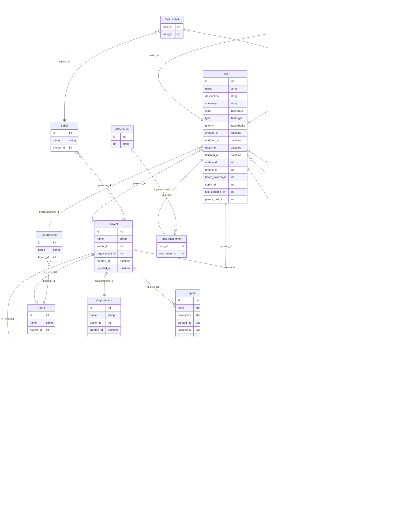

### DB Schema

```mermaid
erDiagram
      Project ||--o{ User : authorId_id
      Project ||--|| Board : id_projectId
      Project ||--o{ Project_User : id_projectId
      Project }o--|| Organization : organizationId_id
      Project ||--o{ Sprint : id_projectId
      Project {
        id int
        name string
        author_id int
        organization_id int
        created_at datetime
        updated_at datetime
    }
      User ||--o{ User_Task : id_userId
      User ||--o{ Project_User : id_userId
      User ||--|| Calendar : id_userId
      User ||--o{ Meeting_User : id_userId
      User ||--o{ Notification : id_userId
      User {
        id int
        name string
        email string
        password string
        salt string
        created_at datetime 
        updated_at datetime
    }
      Task }o--|| User : authorId_id
      Task }o--|| Project : projectId_id
      Task }o--|| BoardColumn : boardColumnId_id
      Task ||--o{ User_Task : id_taskId
      Task ||--o{ Sprint : sprintId_id
      Task ||--o{ Task_Attachment : id_taskId
      Task ||--o{ User : lastUpdatedBy_id
      Task {
        id int
        name string
        description string
        summary string
        state TaskState
        type TaskType
        priority TaskPriority
        created_at datetime
        updated_at datetime
        deadline datetime
        finished_at datetime
        author_id int
        project_id int
        board_column_id int
        sprint_id int
        last_updated_by int
        parent_task_id int
    }

      Comment }o--|| User : authorId_id
      Comment }o--|| Task : taskId_id
      Comment {
        id int 
        author_id int
        task_id int 
        message string
        created_at datetime
        updated_at datetime
    }

      Sprint {
        id int
        name string
        description string
        created_at datetime
        updated_at datetime
        deadline datetime
        project_id int
    }

      Organization {
        id int
        name string
        author_id int 
        created_at datetime
        updated_at datetime
    }

      Label }o--|| Project : projectId_id
      Label {
        id int 
        name string
        project_id int
    } 

      Attachment ||--o{ Task_Attachment : id_attachmentId
      Attachment{
	      id int
	      url string
    }

      Board {
        id int
        name string
        project_id int
    }
      BoardColumn }o--|| Board : boardId_id
      BoardColumn {
        id int 
        name string
        board_id int
    }

      Project_User {
        project_id int
        user_id int
        role_id int
    }

      User_Task {
        task_id int
        user_id int
    }

      Calendar ||--o{ Meeting : id_calendarId
      Calendar {
	      id int
	      user_id int
    }

      Meeting_User {
	      meeting_id int
	      user_id int
    }

      Notification {
	      id int
	      message string
	      user_id int
    }

      Task_Attachment {
	      task_id int
	      attachment_id int
    }

      Role }o--|| Project_User : id_roleId
      Role {
        id int
        name string
    }

      Task_Label }o--|| Task : taskId_id
      Task_Label }o--|| Label : labelId_id
      Task_Label {
        task_id int
        label_id int
    }

      Meeting ||--o{ Meeting_User : id_meetingId
      Meeting {
	      id int
	      starting_time datetime
	      ending_time datetime
	      created_at datetime
	      updated_at datetime
	      calendar_id int
    }
```